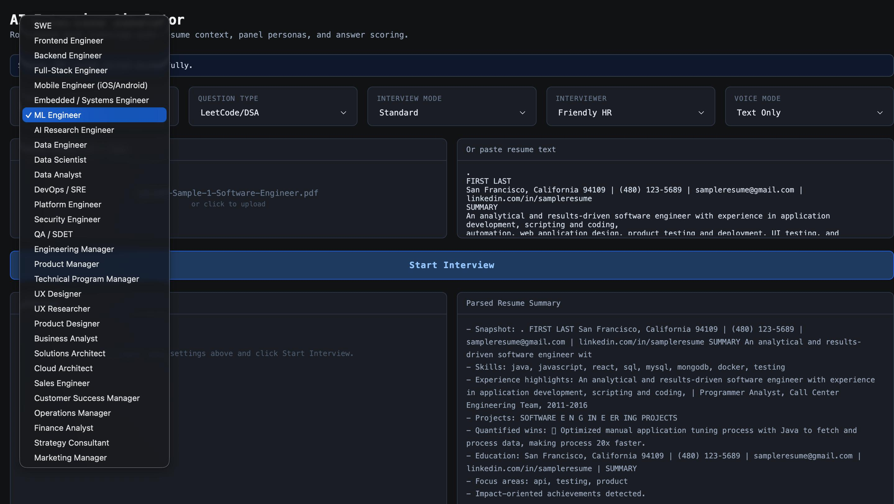
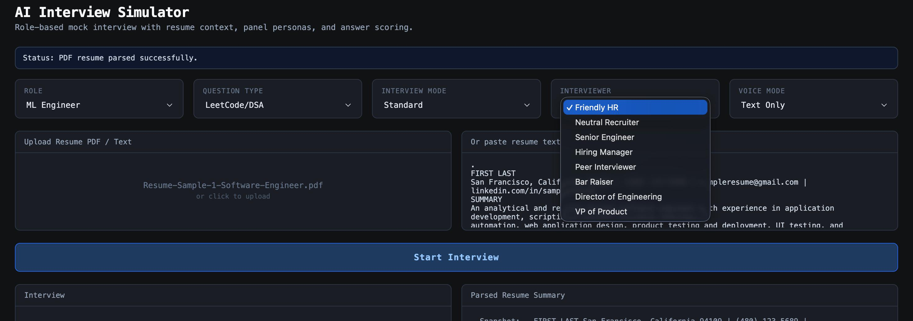

Smart Interview System

AI-powered interview simulator built with React and FastAPI that conducts mock interviews, evaluates responses, and provides intelligent feedback.

---

## Features

- AI-generated interview questions
- Multiple interview roles and domains
- Resume parsing and analysis
- Real-time interview simulation
- LLM-based answer evaluation
- Interactive React frontend
- FastAPI backend APIs
- Configurable interview workflows

---

## Tech Stack

### Frontend
- React
- JavaScript
- CSS

### Backend
- FastAPI
- Python
- OpenAI API

---

## Screenshots

### Interview Configuration Dashboard



### AI Interview Interface



---

## Project Structure

```text
backend/   # API and interview logic
frontend/  # React frontend
assets/    # README screenshots
Prerequisites
Python 3.10+
Node.js 18+
npm
Backend Setup

Install backend dependencies:

source .venv/bin/activate
pip install -r backend/requirements.txt

Create environment file:

cp backend/.env.example backend/.env

Add your OpenAI API key inside backend/.env:

OPENAI_API_KEY=your_key_here

Run backend server:

.venv/bin/uvicorn --app-dir backend main:app --host 127.0.0.1 --port 8000
Frontend Setup

In a new terminal:

npm install
npm start

Frontend runs on:

http://localhost:3000
API Health Checks
curl -s http://127.0.0.1:8000/
curl -s http://127.0.0.1:8000/api/v1/model/health
Running Full Application
Terminal A — Backend
source .venv/bin/activate
.venv/bin/uvicorn --app-dir backend main:app --host 127.0.0.1 --port 8000
Terminal B — Frontend
npm start
Notes
Uses LLM-first interview evaluation flow
Returns 503 when provider rate limits occur
Backend configuration details are available in backend/README.md
Future Improvements
Voice-based interview mode
Interview performance analytics
Multi-language support
Interview history tracking
AI-generated improvement suggestions
